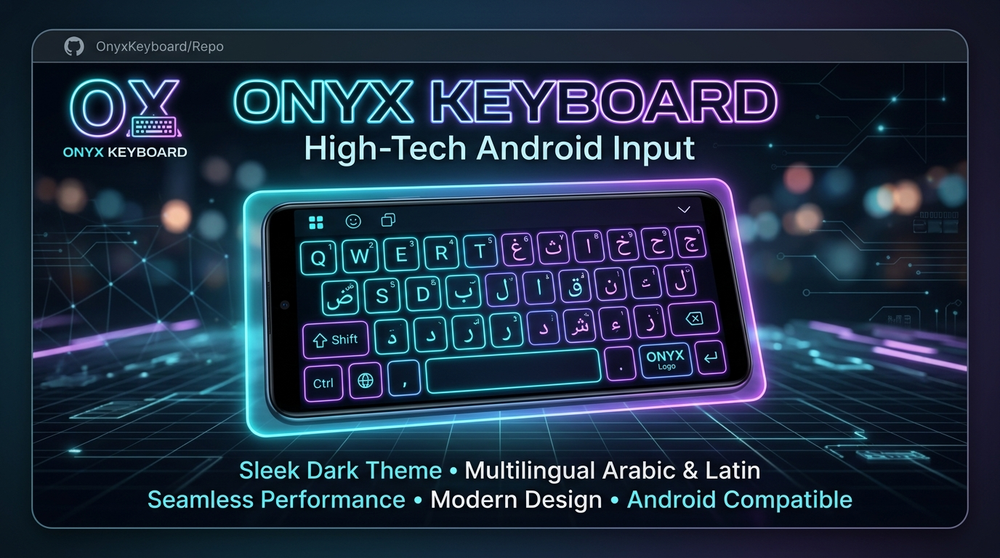
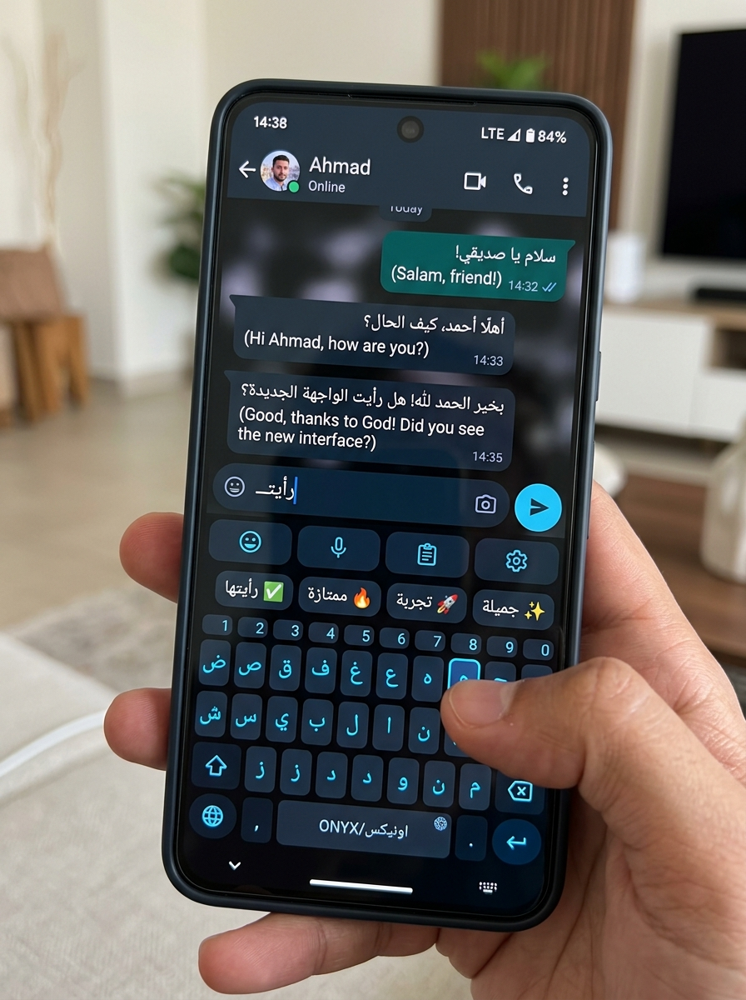
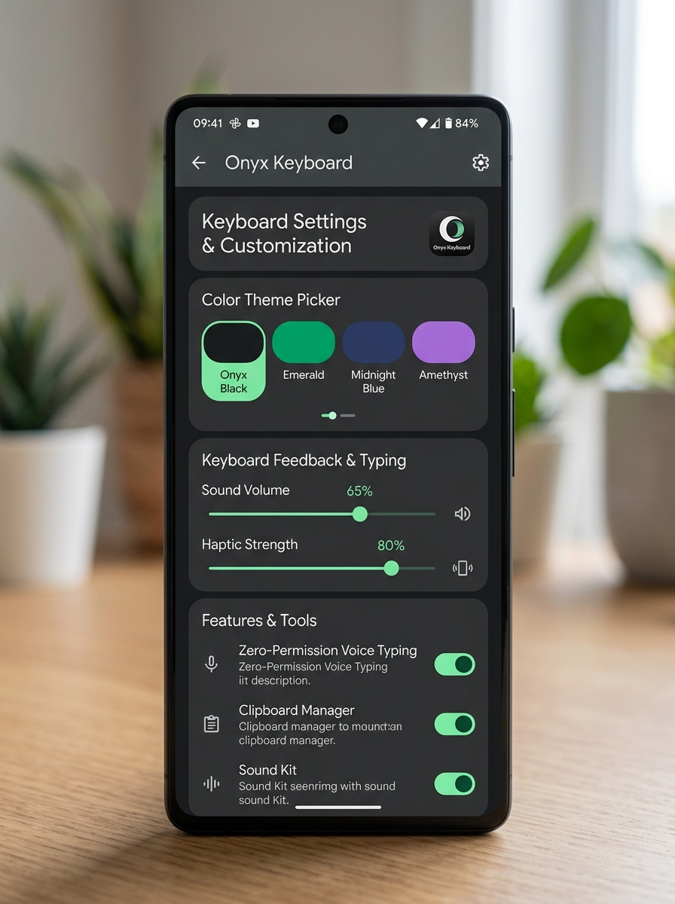

# Onyx Keyboard ⚡

<div align="center">



**An ultra-fast, privacy-first Android smart keyboard powered by an offline C++17 native NDK engine and modern Kotlin architecture with zero permissions.**

[-brightgreen?style=for-the-badge&logo=android)](https://developer.android.com)
[-blue?style=for-the-badge&logo=kotlin)](https://kotlinlang.org)
[](https://github.com)
[](LICENSE)

[**العربية**](README.md) • [**Features**](#-features) • [**Architecture**](#-architecture) • [**Build & Setup**](#-build--setup) • [**Security & Privacy**](#-security--privacy)

</div>

---

## 📸 Screenshots

<div align="center">
  <table>
    <tr>
      <td align="center" width="33%">
        <b>Smart Typing & Prediction Bar</b><br/><br/>
        
      </td>
      <td align="center" width="33%">
        <b>Material You & Settings</b><br/><br/>
        
      </td>
      <td align="center" width="33%">
        <b>Floating & One-Handed Mode</b><br/><br/>
        
      </td>
    </tr>
  </table>
</div>

---

## 🚀 Features

- **⚡ Native C++17 Engine (`libonyx_engine.so`)**:
  - 52 linguistic & predictive algorithms executed directly on-device in under 1ms.
  - Compact Prefix Trie structure for fast word lookups with minimal RAM consumption.
  - Contextual next-word predictions (N-Gram & Markov chains) with adaptive on-device learning.
  - Physical distance-weighted Levenshtein spell checking algorithm.
  - Smart sentence and grammar correction (punctuation, letter repetition, diacritics).
  - Built-in regex entity extraction for URLs, phone numbers, emails, dates, and OTP codes.

- **🪟 Floating Window & Ergonomic Modes**:
  - Freely draggable floating card keyboard with smooth corner resizing (40% to 90%).
  - Quick double-tap presets (50%, 62%, 78%) for instant size recovery.
  - One-handed mode with left/right alignment switches for large screen usability.

- **🎨 Modern Design & Material You**:
  - Android 12+ dynamic color theming based on device wallpaper.
  - Handcrafted AMOLED-friendly dark themes (Onyx Black, Deep Emerald, Midnight Blue, Amethyst, Sunset, Ruby).
  - Tactile, mechanical, modern, and typewriter keystroke sound packages with fine volume slider.

- **📋 Offline Clipboard & Zero-Permission Voice Typing**:
  - Encrypted, local-only historical clipboard manager.
  - Zero-permission speech-to-text bridge using standard system voice recognition.
  - Contextual emoji recommendation engine and searchable categorized emoji picker.
  - Full Arabic diacritics (tashkeel) layer and 60+ font decoration styles.

- **🛡️ Security & Integrity (DownloadUrlValidator)**:
  - Strict HTTPS validation and SSRF protection (blocking loopback, private IPv4/IPv6, and cloud metadata IPs).
  - Path traversal and header injection sanitization.
  - Constant-time SHA-256 checksum verification.

---

## 🏗️ Architecture

```
Onyx-Keyboard/
├── app/
│   ├── src/
│   │   ├── main/
│   │   │   ├── cpp/                    # Native C++17 Core
│   │   │   │   ├── onyx/               # Algo, Trie, Grammar, Engine, UTF-8
│   │   │   │   ├── onyx_jni.cpp        # JNI Bridge
│   │   │   │   └── CMakeLists.txt
│   │   │   ├── java/com/onyx/keyboard/
│   │   │   │   ├── data/               # Prefs & Clipboard
│   │   │   │   ├── engine/             # OnyxEngine JNI wrapper
│   │   │   │   ├── ime/                # Keyboard Service & Views
│   │   │   │   ├── model/              # Themes, Keys & Languages
│   │   │   │   ├── spell/              # System Spell Checker
│   │   │   │   ├── ui/                 # Settings & Activities
│   │   │   │   └── util/               # DownloadUrlValidator & Helpers
│   │   │   ├── assets/onyx/dicts/      # Preloaded Multilingual Dictionaries
│   │   │   └── AndroidManifest.xml
│   │   └── test/java/                  # JVM Unit Tests
│   └── build.gradle.kts
├── docs/images/                        # Screenshot & Banner Assets
├── LICENSE
└── README.md
```

---

## 🛠️ Build & Setup

### Requirements
- **Android Studio** (Koala / Ladybug or newer)
- **Android SDK** API 26+ (Targeting API 34+)
- **Android NDK** (r26+ recommended)
- **CMake** 3.22.1+
- **JDK 17**

### Build Commands
```bash
# Clone the repository
git clone https://github.com/your-username/onyx-keyboard.git
cd onyx-keyboard

# Run unit tests
./gradlew testDebugUnitTest

# Assemble Debug APK
./gradlew assembleDebug
```

---

## 🔒 Security & Privacy

Onyx Keyboard is designed with a strict zero-permission architecture:
- No `android.permission.INTERNET` declared in `AndroidManifest.xml`.
- No sensitive background clipboard eavesdropping.
- No direct audio recording permissions (`RECORD_AUDIO`).
- No telemetry, analytics, or third-party tracking libraries.

---

## 📜 License

Distributed under the **MIT License**. See [LICENSE](LICENSE) for more information.
